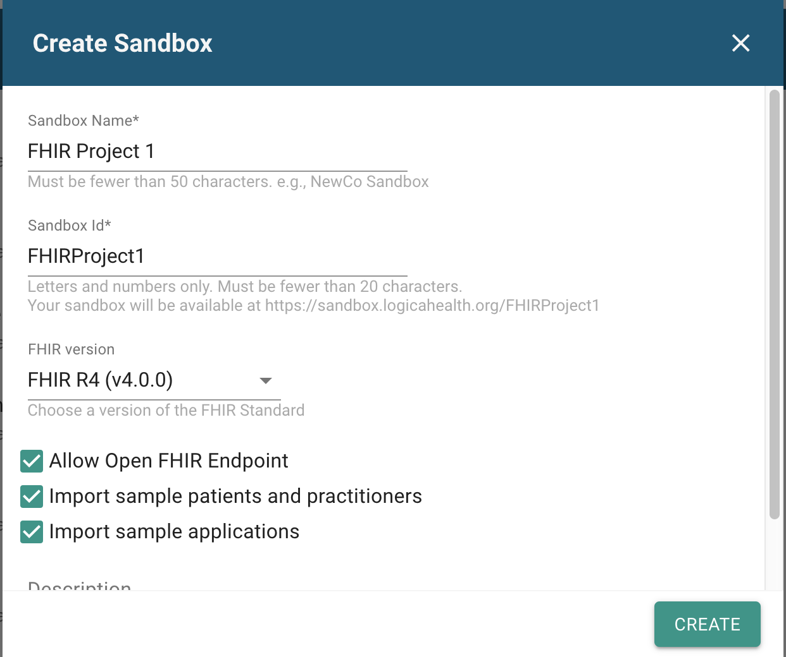
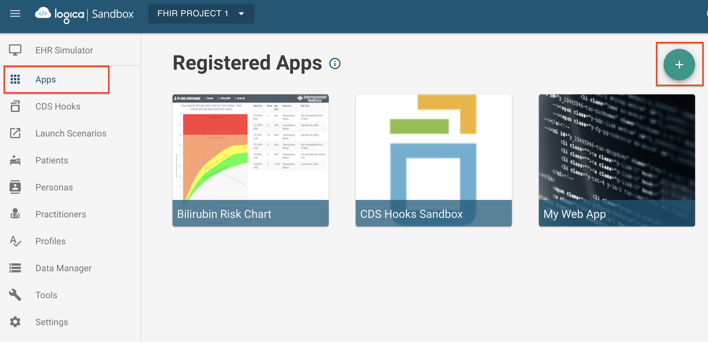
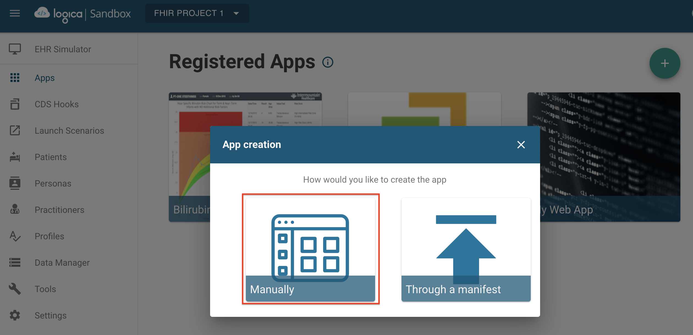
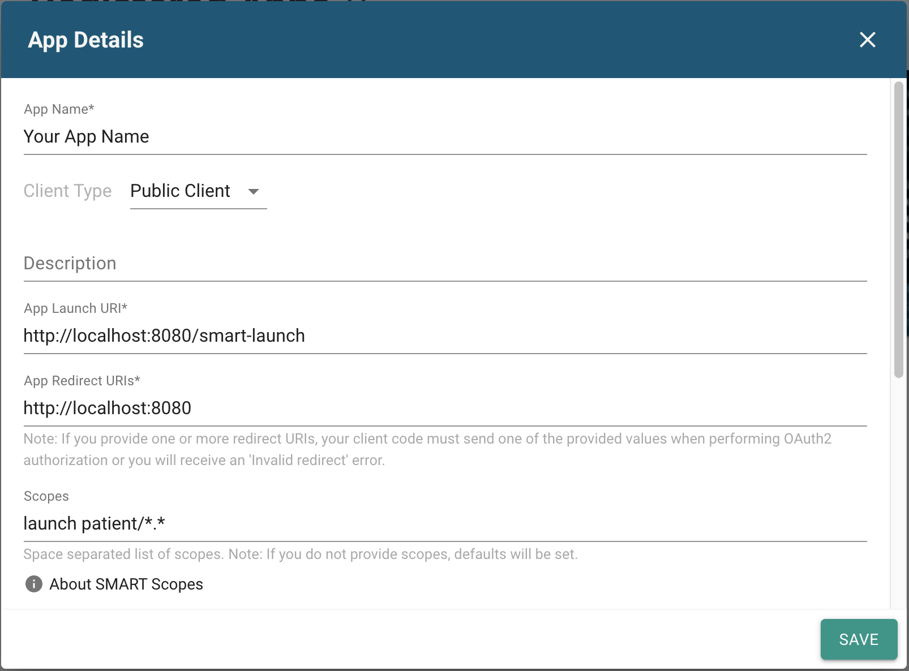
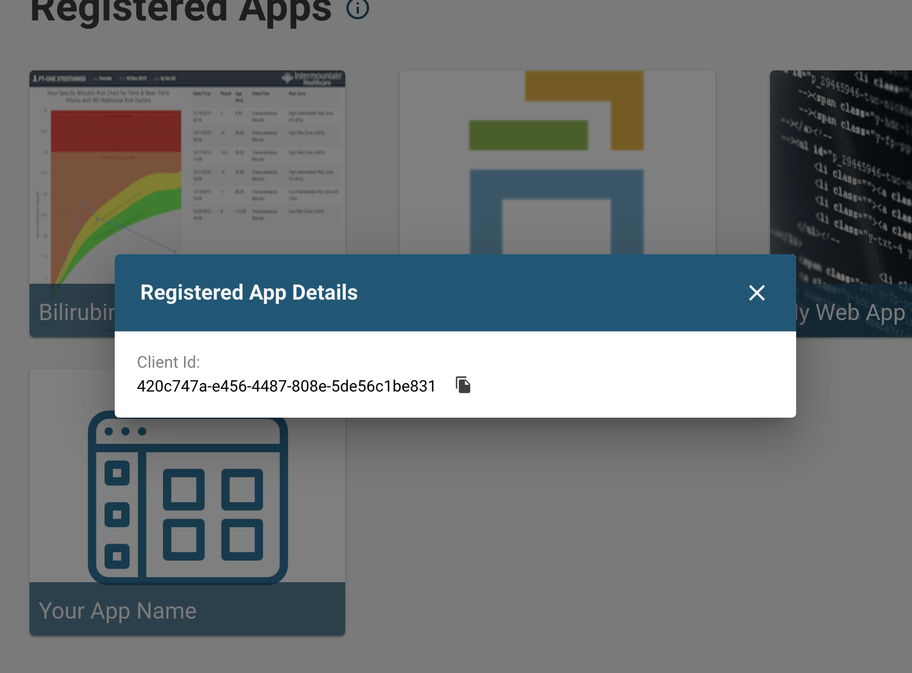
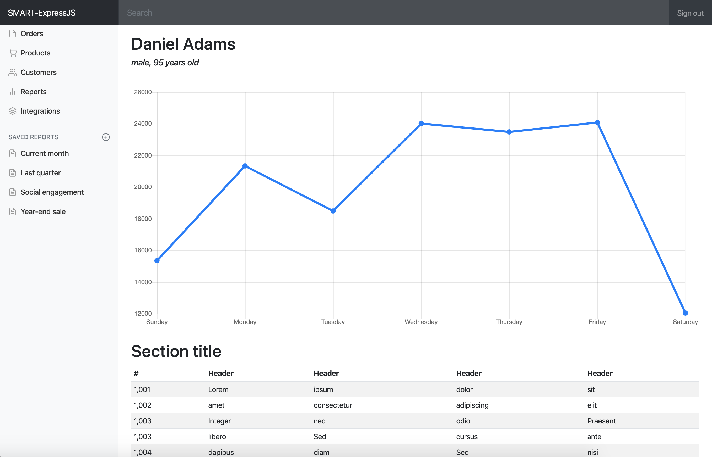

# SMART-ExpressJS
Boilerplate code which can be modified to create an ExpressJS SMART on FHIR app.

Adapted from this [tutorial](https://github.com/cerner/cds-services-tutorial/wiki) by Cerner. 
Architecture uses [Express](https://expressjs.com/). 
Templating done via [EJS](https://ejs.co/). 
Front-end display uses Bootstrap's [Dashboard](https://getbootstrap.com/docs/4.0/examples/) example (v4.0).

## 1. Create a SMART on FHIR sandbox
This app was developed using an [HSPC Logica Sandbox](https://sandbox.logicahealth.org/) as the launch environment. 
Create an account and then create a new sandbox making sure that you use FHIR version R4, allow an open FHIR endpoint, and import sample patients, practitioners, and applications.

### Register this app with your sandbox

Select the "Apps" option on the sidebar and press the button to add an app.

Select the option to "Manually" create the app

On the details page, give the app a name and ensure that the "Public Client" option is selected. Enter the following parameters as shown below:

App Launch URI: <code>http://localhost:8080/smart-launch</code> 
App Redirect URI: <code>http://localhost:8080/</code> 
Scopes: <code>launch patient/\*.\*</code>

After saving, you will be given a client ID.

Copy this ID and open the file <i>index.js</i>.

At the top of this file you will see:  <code>let client = "REPLACE-WITH-CLIENT-ID-FROM-SANDBOX"</code> 
Paste the ID there so that it looks something like this (but with your ID): 
<code>let client = "420c747a-e456-4487-808e-5de56c1be831"</code>  Save the file

## 2. Start the app server
This project uses a Docker image to include the needed dependencies for the app server. Follow [this guide](https://docs.docker.com/install/) to install Docker on your machine and check installation success with <code>docker -v</code>. Then follow [this guide](https://docs.docker.com/compose/install/) to install Docker Compose and check that installation with <code>docker-compose -v</code>.

Launch the server with the command <code>docker-compose up --build</code>

## 3. Perform a SMART launch
From the sandbox, launch your app and select a patient. The type of SMART launch we defined when registering our app depends on a patient (learn more about scopes [here](http://www.hl7.org/fhir/smart-app-launch/scopes-and-launch-context/index.html)). You'll see that the app redirects to the HSPC authorization server where you are prompted to authorize the app. Once authorized, you are taken to the app where this example demonstrates how to use the auth token to query the Patient resource and how to parse out the patient name, gender, and age.

